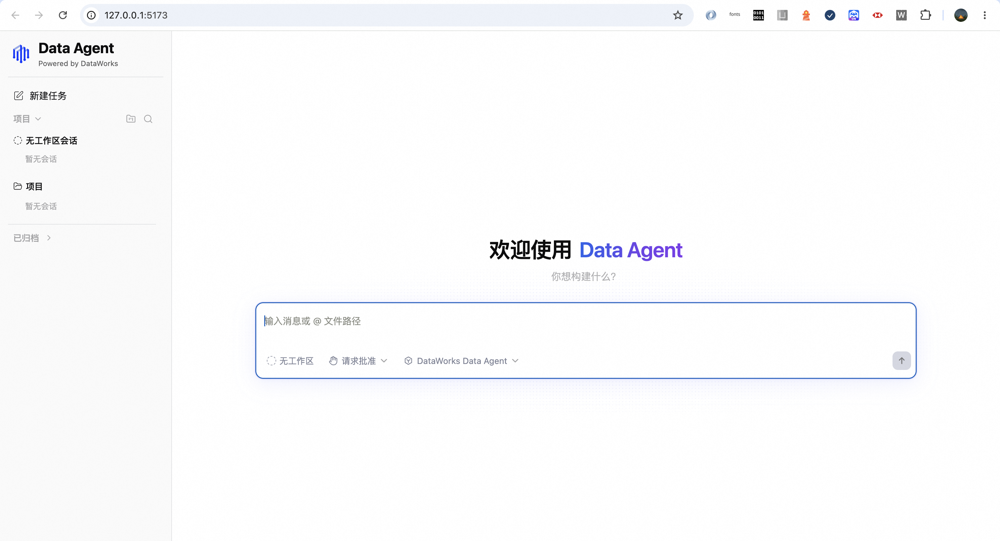

# DataAgent OpenAPI 多语言示例

[English](README.en.md) · [GitHub](https://github.com/aliyun/alibabacloud-data-agent-openapi-examples)

通过 OpenAPI 来体验 DataWorks DataAgent：创建会话、发送问题、查看逐步回复、停止任务和查看历史。项目提供 Java、Python 和 Node.js 三种语言的示例，并配有统一的网页，方便直接体验 OpenAPI 的调用效果。

每次只需要启动一个后端和一个前端。选择语言不会改变网页的使用方式，也不需要同时安装三种语言的运行环境。

> 三种后端均已完整接入 web-shell（会话、流式回复、停止、历史），各自配有「会话/流式/409 在途锁/404 语义/生命周期」14 条逐项比对断言，且三个实现的 LIVE 真实链路也都单独实测连通。

## Demo 页面预览

Data Agent · Powered by DataWorks。启动服务后，打开终端提示的地址（默认 <http://127.0.0.1:5173>），即可在统一的网页中创建会话、输入问题并查看流式回复。以下为浅色主题下的首页：



## 选择语言，一键启动

所有语言都需要 Node.js 22.x（至少 22.12）或 24.x（推荐 22.x）及 npm 10+ 来运行网页。下面的命令适用于 macOS、Linux、Windows（原生 cmd / PowerShell）、Git Bash 和 WSL。

在项目根目录安装公共依赖：

```bash
npm ci
```

调用真实 OpenAPI 前，请按下文[使用自己的 DataAgent](#使用自己的-dataagent)配置根目录 `.env`，填写凭证并设置 `MOCK=0`。然后任选一种语言启动；每条启动命令都会同时运行该语言的后端和网页，不需要另开终端启动前端。

### Java

额外需要 JDK 17+ 和 Maven 3.6.3+。一键启动：

```bash
npm start -- java
```

暂时没有凭证时，可先运行 `MOCK=1 npm start -- java` 体验固定示例。首次启动自动下载依赖并构建，可能需要几分钟。更多说明见 [Java 安装与独立运行](server-java/README.md)。

### Python

额外需要 Python 3.11+。首次使用先安装 Python 依赖：

```bash
python3 -m venv server-python/.venv
server-python/.venv/bin/python -m pip install -e ./server-python
```

一键启动：

```bash
npm start -- python
```

免凭证启动使用 `MOCK=1 npm start -- python`。三种后端均已接入完整网页会话交互。更多说明见 [Python 安装与独立运行](server-python/README.md)。

### Node.js

完成上面的 `npm ci` 后，无需额外安装其他语言环境。一键启动：

```bash
npm start -- node
```

暂时没有凭证时，可先运行 `MOCK=1 npm start -- node` 体验固定示例。更多说明见 [Node.js 安装与独立运行](server-node/README.md)。

### 打开网页与停止服务

免凭证体验的外壳写法：
- macOS / Linux / Git Bash：`MOCK=1 npm start -- java`
- Windows PowerShell：`$env:MOCK="1"; npm start -- java`
- Windows cmd.exe：`set MOCK=1 && npm start -- java`
- 双平台通用的快捷方式：`npm start -- java --mock`（`.env` 里已配置时也用 `--mock` 一键切换回放）

打开终端提示的地址，默认是 <http://127.0.0.1:5173>。选择一个示例会话并发送问题，就能看到回复过程。MOCK 模式回放示例数据，不调用云服务；回答不会根据你输入的内容重新生成。

出现网页地址后再打开浏览器。按 `Ctrl+C` 同时停止后端和网页；要换语言，先停止再执行对应命令。

`npm start` 默认选择 Node.js，`npm run dev -- python` 与 `npm start -- python` 等价；已有的 `bash scripts/dev.sh java` 也使用同一个启动入口。只启动后端的方法见各语言说明。

## 让同事通过内网访问

在原启动命令后加 `--lan`：

```bash
npm start -- java --lan
```

同事打开终端输出的 `http://内网IP:5173` 即可。Node.js、Python 同样支持；免凭证演示可再加 `--mock`。所有访问者共用当前云账号权限与会话，仅适合可信内网内共享。详细步骤、Windows 命令及网络排查见[内网访问指南](docs/LAN_ACCESS.md)。

## 使用自己的 DataAgent

准备已开通 DataWorks 的阿里云账号、可用的 DataAgent 实例，以及具备对应权限的 RAM 用户 AccessKey。建议使用 RAM 用户凭证。没有运行中的实例时，还需要准备可用的 Serverless 资源组 ID。

1. 在项目根目录执行 `cp .env.example .env`。
2. 编辑 `.env`，填写下表配置。
3. 执行 `npm start -- node`、`npm start -- python` 或 `npm start -- java`。
4. 打开网页，新建会话并发送问题。

| 配置 | 如何填写 |
| --- | --- |
| `MOCK` | 真实使用填 `0`；免凭证体验填 `1` |
| `ALIBABA_CLOUD_ACCESS_KEY_ID` | RAM 用户的 AccessKey ID |
| `ALIBABA_CLOUD_ACCESS_KEY_SECRET` | 对应的 AccessKey Secret |
| `DATAAGENT_REGION_ID` | 实例所在地域，默认 `cn-hangzhou` |
| `RESOURCE_GROUP_ID` | 没有运行实例时填写 Serverless 资源组 ID |
| `END_POINT` | 通常留空；需要指定网关时填域名，不带 `https://` |
| `DATAAGENT_AGENT_NAME` | 通常保持 `dataworks_data_agent` |
| `SESSION_SOURCE` | 会话来源标记；更改后列表可能不再显示原来源的会话 |

凭证仅由后端使用。不要把凭证放进 `VITE_` 开头的变量或提交 `.env`。MOCK 命令中的 `MOCK=1` 会优先于文件里的配置；真实使用时请去掉这个前缀。

## 网页里可以做什么

网页直接使用 OpenAPI 返回的真实 `sessionId`。创建会话并发送问题后，地址更新为 `/session/{sessionId}`，支持刷新恢复、分享及浏览器前进后退。

在前端连接任意一种后端（Node.js / Python / Java）时，都可以新建或打开会话，发送文字问题并查看流式回复、思考过程和工具执行结果。需要中止时点击停止。人卡交互（权限确认、ask_user_question 补充信息）现已接入：agent 发起人工确认会弹卡，点选或补答后回覆将通过 ReplyAgentSession 回传并继续执行。后端重启后，重新打开会话会从历史恢复仍待回答的人卡。

历史来自云端，重要结果请及时保存。网页中会话改名、归档和删除目前只在本次后端进程内保存，重启后可能恢复原状态。Token 用量查询属于后端能力，不表示当前网页提供完整用量面板；上下文占用和部分网页功能也可能因后端缺少相应能力而不可用。

真实任务可能访问或修改你有权限操作的数据。先用小范围、容易验证的问题确认环境与权限，再执行正式任务。

## 换端口或切换配置

后端默认使用 `3000`，网页默认使用 `5173`。一键启动会自动让网页连接本次启动的后端：

```bash
PORT=3100 WEB_PORT=5180 npm start -- python
```

端口已被占用时，启动命令会报错。先停止原来的服务或换端口；不会自动关闭其他进程。

## 单独启动后端与网页（不走一键脚本）

封装为一键的 `npm start` 只做了三件互不相干的事：构建 jar（要重构的场合）、起后端、向前传参数起网页。把它们分开手动起也有同样效果：

```bash
# 1) 构建 jar（第一次或源码有改动时）
mvn -f server-java/pom.xml -q -DskipTests package

# 2) 后端（终端一）：默认 http://127.0.0.1:3000
java -jar server-java/target/das-server-java-0.1.0.jar
#   MOCK 免凭证（回放合成样例）：
#   mac/Linux/Git Bash：`MOCK=1 java -jar ...`
#   Windows PowerShell：`$env:MOCK="1"; java -jar ...`
#   Windows cmd.exe：`set MOCK=1 && java -jar ...`
#   LIVE 链路：从仓库根 `.env`（或 `DAS_ENV=<name>`）读配置
#   变端口：`java -jar ... --server.port=3999` 或 PORT=3999

# 3) 前端（终端二）：指向后端的地址
cd web && VITE_API_BASE=http://127.0.0.1:3000 npm run dev
#   Windows PowerShell：`cd web; $env:VITE_API_BASE="http://127.0.0.1:3000"; npm run dev`
#   Windows cmd.exe：`cd web && set VITE_API_BASE=http://127.0.0.1:3000 && npm run dev`
```

打开 <http://127.0.0.1:5173>。如果看到 **"daemon server 无法链接"**，按下面两步排查：

1. `curl http://127.0.0.1:3000/api/health`——后端还活着没；命令没回 = 后端没起
2. `VITE_API_BASE` 跟后端的 PORT 必须对应（改了就**重启 web dev server**：dev server 在启动时吃 compile env，hot-reload 不重新读 VITE_API_BASE）

可以为不同账号或环境分别创建 `.env.<name>`，例如 `.env.demo`，然后：

```bash
DAS_ENV=demo npm start -- java
```

选中的文件必须包含完整配置，不会与默认 `.env` 合并。指定文件不存在时会停止启动。进程环境变量优先于文件。

## 常见问题

**网页打不开或显示后端未连接**：确认终端仍在运行，查看是否提示缺少运行环境、凭证或端口占用。使用终端输出的网页地址。一键入口会等待后端就绪；单独启动前端时，需要自己配置后端地址。

**为什么演示中的回答与问题无关？** MOCK 是固定示例回放。要获得真实回答，请配置自己的账号并使用 `MOCK=0`。

**创建会话失败**：检查地域、权限以及实例或资源组是否可用。服务启动或健康检查成功，只代表本地服务可用，不代表云端权限和额度全部通过。

**回复中途断开，是否再发一次？** 不要直接重发。任务可能仍在云端执行，重发可能重复执行写操作。先重新打开会话查看历史，或在云端确认结果。长任务可能遇到流式连接时长限制；网页恢复连接不等于上游任务能够断点续跑。

**只收到回执，没有回答**：先检查账号额度和权限，再拉取历史确认是否留下内容；不要把“收到回执”当成任务成功执行。

**停止后历史里看不出取消状态**：实时取消结果和历史记录可能不完全一致，不能仅凭历史缺少终态判断取消失败。

**旧会话无法继续**：会话与执行端的绑定可能失效。保存已有结果后新建会话尝试。

**不同语言是否完全相同？** 三种实现的目标是支持同一套 web-shell 操作并已全部接入；契约断言（HTTP/NDJSON 层 34×3）与 daemon 层逐项比对（14×3）均通过。契约与网页断言通过不代表所有云端环境特性都已逐一验证，真实链路连通性以外仍以上游行为为准。语言专项说明中列出了安装与运行方法。

## 更多说明

- [Node.js 安装与独立运行](server-node/README.md)
- [Python 安装与独立运行](server-python/README.md)
- [Java 安装与独立运行](server-java/README.md)
- [目录与验证命令](docs/DEVELOPMENT.md)

本示例默认用于本机体验。对外提供多人访问前，需要自行配置身份认证、访问控制和凭证隔离。
